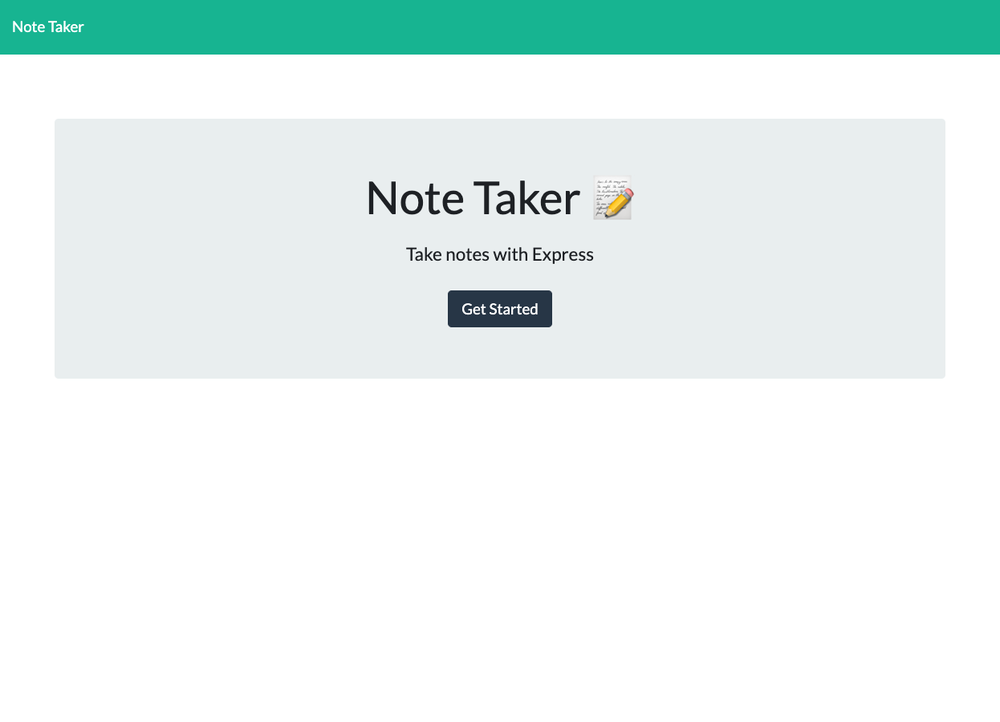
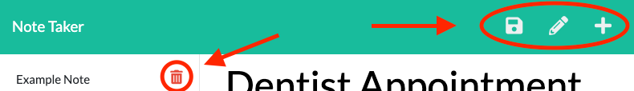

# Note Taker
 
              

## Description
A Node.js server powered by Express.js that will allow you to write and store notes in the Cloud.  

[View a Live Demo](https://qcent-note-taker.herokuapp.com/) on [Heroku](https://www.heroku.com/).

Screenshot  
 

## Table of Contents

* [Description](#description)
* [Table of Contents](#table-of-contents)
* [Installation](#installation)
* [Usage](#usage)
* [Credits](#credits)
* [Questions](#questions)
* [License](#license)

## Installation

This project requires Node.js and npm are installed on the target machine.  
Once the project files have been downloaded you must run `npm i` or `npm install`.  
This will install the Express.js library.

In the `server.js` file you can alter line 3 to set a custom `PORT` to run the server on, or alternatively set the process environment variable `PORT` to the desired port number on your machine.
```
const PORT = process.env.PORT || <YOUR PORT NUM>;
```

## Usage

After installation make sure you are in the project's root directory and run `node start` or `node server.js`. 

Then navigate to the server's ip address on the `PORT` configurable in `server.js` (default 3001). 

example:
```
open http://localhost:3001/
```
 If all is well you will be looking at the app's loading page.
 

 Clicking on the `Get Started` button will bring you to the app's main page where you can create, edit and save notes at will.
 

 In the top left of the screen is your toolbar. Click the 'Disc' icon to save. Click the 'Pencil' icon to edit.  Click the 'Plus' icon to create a new note.  
 

## Credits
The front end of this project was designed by Trilogy Education Services with only minor tweaks and a single addition by me.  
This project is powered by Express.js and a special thanks goes out to the hard working developers that made that project possible.  
I would also like to thank the good people providing the data hosting at Heroku as well as the kind people at GitHub.

## Questions

[GitHub: Qcent](https://github.com/Qcent)  
dquinn8@cogeco.ca

   
## License

MIT License

Copyright (c) 2021 Dave Quinn

Permission is hereby granted, free of charge, to any person obtaining a copy
of this software and associated documentation files (the "Software"), to deal
in the Software without restriction, including without limitation the rights
to use, copy, modify, merge, publish, distribute, sublicense, and/or sell
copies of the Software, and to permit persons to whom the Software is
furnished to do so, subject to the following conditions:

The above copyright notice and this permission notice shall be included in all
copies or substantial portions of the Software.

THE SOFTWARE IS PROVIDED "AS IS", WITHOUT WARRANTY OF ANY KIND, EXPRESS OR
IMPLIED, INCLUDING BUT NOT LIMITED TO THE WARRANTIES OF MERCHANTABILITY,
FITNESS FOR A PARTICULAR PURPOSE AND NONINFRINGEMENT. IN NO EVENT SHALL THE
AUTHORS OR COPYRIGHT HOLDERS BE LIABLE FOR ANY CLAIM, DAMAGES OR OTHER
LIABILITY, WHETHER IN AN ACTION OF CONTRACT, TORT OR OTHERWISE, ARISING FROM,
OUT OF OR IN CONNECTION WITH THE SOFTWARE OR THE USE OR OTHER DEALINGS IN THE
SOFTWARE.
                 

     
